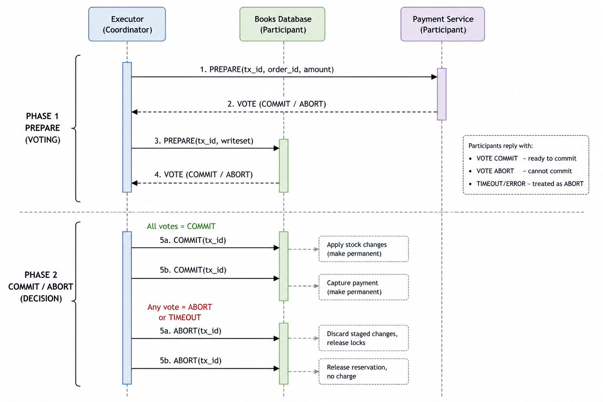

# Checkpoint 3

This checkpoint covers the distributed books database and the 2-phase commit workflow used by the executor for order execution.

## Architecture

The system is organized around three main layers:

- Frontend and orchestrator receive or create orders.
- Order queue elects the active executor.
- Executor coordinates payment and stock updates, while the books database maintains replicated state.

The database side uses a primary-replica design. The executor talks to the primary database replica, and the primary propagates write-related work to the backups.

## Consistency Protocol

The database module uses a primary-backup replication strategy with majority quorum.

### Consistency diagram

Suggested content for the diagram:

- Executor reads stock from the primary.
- Primary sends prepare/write state to Backup 1 and Backup 2.
- Backups acknowledge.
- Primary commits after quorum.

## Distributed Commitment Protocol

The executor coordinates a two-phase commit protocol with the payment service and the books database.

Protocol summary:

1. Phase 1: prepare.
2. The executor asks payment to prepare.
3. The executor asks the database to stage the stock changes.
4. If all participants vote yes, the executor moves to commit.
5. If any participant votes no or times out, the executor aborts the transaction.
6. After commit, participants execute their actual side effects.

### Diagram Placeholder

Insert the distributed commitment sequence diagram here.

Suggested content for the diagram:

- Executor sends prepare to payment and database.
- Payment and database reply with vote commit or vote abort.
- Executor sends commit or abort.
- Participants execute the final action after commit.

## Validation Against the Task

The current implementation follows the checkpoint-3 intent in these areas:

- The database is replicated.
- The executor coordinates distributed commitment.
- The payment service participates in 2PC.
- The database service now also participates in 2PC.
- Docker Compose can launch the full stack.
