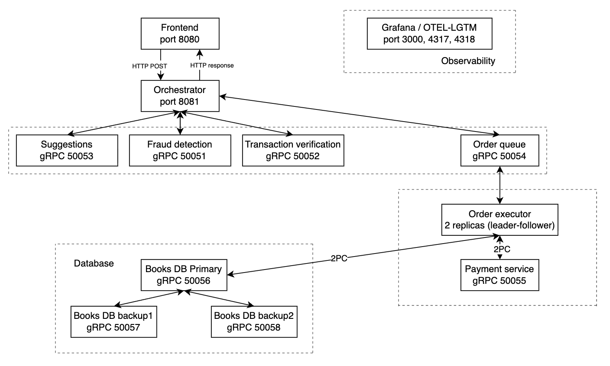

# Checkpoint 4

This document summarizes the final implementation for the checkpoint 4: end-to-end testing, monitoring and observability.

## Architecture diagram

System overview:
- Frontend: user checkout form, served by Nginx on port 8080.
- Orchestrator: Flask REST endpoint (/checkout) on port 8081.
- Transaction verification, fraud detection, suggestions: gRPC services that implement the six events with vector clocks.
- Order queue: gRPC service (port 50054) that holds orders and performs leader election.
- Order executor: two replicas, the elected leader pulls orders from the queue and executes a 2‑phase commit with the payment service and the books database.
- Payment: gRPC participant in the 2PC protocol.
- Books database: primary (port 50056) with two backups (ports 50057, 50058). The primary uses majority quorum (2/3) to commit writes.
- Observability: Grafana/OpenTelemetry backend (otel‑lgtm) on ports 3000 (UI), 4317 (gRPC), 4318 (HTTP).
- Locust: load testing container that runs automatically with predefined scenarios.

## End-to-End Testing

The system is tested using both manual and automated approaches. Postman is used for scenario-based testing. Locust enables automated load testing and performance evaluation.

## Observability

The system implements observability using OpenTelemetry. Telemetry data is exported from services such as the orchestrator and executor to the observability stack, where Prometheus collects metrics, Tempo stores traces and Grafana is used for visualization.

[checkpoint-4-observability-dashboard.json](./checkpoint-4-observability-dashboard.json)